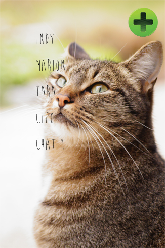
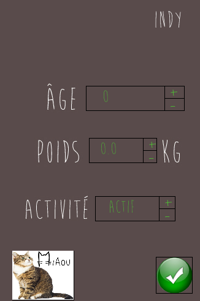
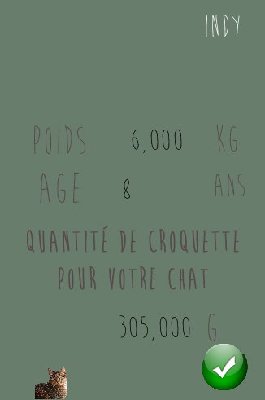

# CatAdvisor
Cette application est un projet de l'option Informatique et Sciences du Numérique de la filière Scientifique en vu de le présenter au baccalauréat. Elle a été développer avec le langage Processing version 3 qui est basé sur la plateforme JAVA.

La problématique était de développer une application à but sociétal. Nous avons choisi de créer un système de gestion de profil pour les chats. Grâce à ce système l'utilisateur connaitra la quantité de nourriture journalière pour son chat.

Nous avons été 4 à créer les différents éléments. Il n'y a aucune 

Lorsque l'application se lance il y a un menu de démarrage. Ensuite sur l'accueil on a la liste des chats, on peut alors consulter leur profil (nom, poids, âge, activité, quantité de nourriture). Sur cette page on retrouve aussi le bouton pour ajouter un nouveau profil. Sur la page qui s'affiche on peut paramétrer le nouveau profil avec les éléments cités précédemment. Enfin on arrive sur une page récapitulative avec la quantité de nourriture affichée.

Voici les visuels de l'application :

**Page de démarrage**

**Accueil et liste des profils**

**Page de paramétrage du profil**

**Page récapitulative du profil**

